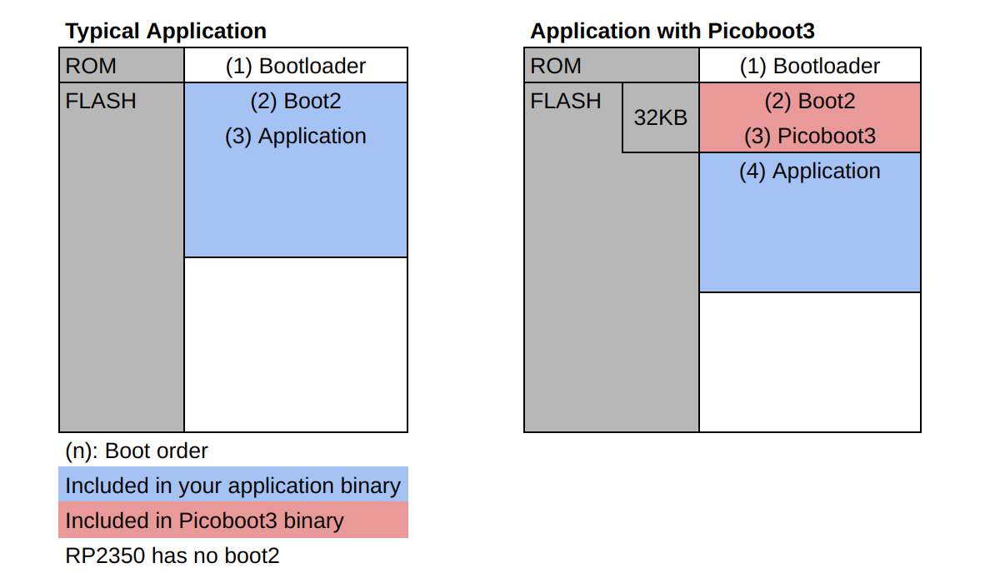

# Picoboot3

Custom bootloader that allows firmware updates to Raspberry Pi Pico via UART/I2C. 

## Features

### Firmware Update via UART/I2C

Raspberry Pi Pico's built-in bootloader allows you to write firmware via USB or SWD. 
However, in some situations, other interfaces may be useful. 
Picoboot3 now offers the options of UART and I2C.

Let's think about you have a custom Pico board that runs on a Raspberry Pi. 
You can provide end users with firmware update functionality without USB connectors. 

### Doesn't Affect Existing Bootloader

- Even with Picoboot3 the original method still works. 
You can also use USB, SWD or picotool to write firmware. 

### Easy to Migrate

- No code changes are required for existing projects, just small changes 
to cmake and linker scripts.
- Command line and Python programmer for hosts are available. 

### Configurable

You can configure below easily by editing the header file. 
- BOOTSEL3 pin that switches between picoboot3 and your application code
- UART#, TX/RX pins and baudrate
- I2C#, SDA/SCL pins and device address

## How it Works

### Memory Map

Below are the memory maps for a typical application and an application using Picoboot3.

### Typical Application

When the MCU is reset, the built-in bootloader (1) in the ROM area is executed first. 
Then the second stage boot2 (2) located at the top of the flash is executed. 
Typically boot2 is included in your application binary. 
After that, application code (3) is executed. 

### Application with Picoboot3

For applications that use Picoboot3, boot2 is included in the Picoboot3 binary.
Picoboot3 is executed after boot2, something like "3rd stage". 

First, Picoboot3 reads the BOOTSEL3 pin (default is GP22). 
If this pin is set low, picoboot3 will wait for the host to send firmware to the device.
If the pin is set high or open, the application will run. 
The application code is located at 32KB offset from the top of flash.

For more information about bootloader, you can read a 
[helpful article](https://vanhunteradams.com/Pico/Bootloader/Bootloader.html) 
by V. Hunter Adams.

## Supoorted Platform

- Tested on Pico SDK 2.0.0. 
- Designed for projects on Pico SDK. Arduino core based projects are not supported. 
- Supports RP2040 and RP2350 MCUs. 
- Supports Arm core. RISC-V core is not supproted. 
- UART interface was tested on Windows/Linux/Raspberry Pi hosts and 
FTDI/Raspberry Pi UART/Pico debugprobe adapters. 
- I2C interface was tested on Raspberry Pi host. 

# Getting Started

## Pre-compiled Binaries

If you are fine with the default configuration, 
pre-compiled binaries for Pico and Pico2 boards are available in 
[releases](https://github.com/IndoorCorgi/picoboot3/releases). 

Download it and write to your board as you normally would. 

## Building Picoboot3

Clone this repo and edit the "Configurations" section of 
[picoboot3.h](src/picoboot3.h) if you want. 

If you use VS Code and Raspberry Pi Pico extension, 
open this directory and import as Raspberry Pi Pico project. 

Change PICO_BOARD value in [CMakeLists.txt](CMakeLists.txt) to match your board. 
(e.g. pico2)
~~~
set(PICO_BOARD pico CACHE STRING "Board type")
~~~

Build Picoboot3 and write it to the board in the same way 
as you would build a normal application. 

For example:
~~~
cmake -B build -G Ninja -DPICO_SDK_PATH=your_sdk_path
ninja -C build
~~~

## Modify Your Application

Two small changes are required to run your application on Picoboot3.
- Add flash address offset (default 32KB). 
- Exclude second stage boot2 as it's included in Picoboot3. (RP2040 only)

See [blink project](examples/blink_pb3) as an example. 

Copy "memmap_default.ld" from Pico SDK to your project. 
It's located in below path in Pico SDK

| MCU    | Path | 
| ----   | ---- |
| RP2040 | your_sdk_path/src/rp2_common/pico_crt0/rp2040 |
| RP2350 | your_sdk_path/src/rp2_common/pico_crt0/rp2350 |

Go to "MEMORY" block in the ld file and replace the following line
~~~
INCLUDE "pico_flash_region.ld"
~~~
with something like below. 
~~~
FLASH(rx) : ORIGIN = 0x10000000 + 32k, LENGTH = 2048k - 32k
~~~

"+ 32k" in ORIGIN is to add 32KB offset to the application. 
While, subtract 32k from the total flash size of 2048k.
As for total flash size, set it according to your board. 
Using Pico2 it becomes 4096k. 

Go to "SECTION" block and comment out or remove the boot2 like below. 
(RP2040 only. Not needed for RP2350)
~~~
    /*
    .boot2 : {
        __boot2_start__ = .;
        KEEP (*(.boot2))
        __boot2_end__ = .;
    } > FLASH

    ASSERT(__boot2_end__ - __boot2_start__ == 256,
        "ERROR: Pico second stage bootloader must be 256 bytes in size")
    */
~~~

Add below line to your CMakeLists.txt to load the modified ld file. 
~~~
pico_set_linker_script(${CMAKE_PROJECT_NAME} ${CMAKE_SOURCE_DIR}/memmap_default.ld)
~~~

Now build it as you normally would. 

## Install Programmer

A command line interface and a Python package 
[programmer](https://github.com/IndoorCorgi/picoboot3py) is available.
Install with the following command. 
~~~
pip3 install picoboot3
~~~

If you have "error: externally-managed-environment", create virtual env or 
use below option to install to the system. 
~~~
sudo pip3 install picoboot3 --break-system-packages
~~~

## Write Your Firmware via UART

On Raspberry Pi, make sure UART is enabled. 

Connect the device as follows:
| Host    |      | Device (Pico) |
| ----    |:----:| ----          |
| UART TX | ---  | UART RX (Default is GP1)  |
| UART RX | ---  | UART TX (Default is GP0)  |
| GND     | ---  | GND           |

Reset the MCU by holding BOOTSEL3 pin (default is GP22) low to enter bootloader mode. 

Write firmware with the following command. 
Only bin format is supported. Do not use elf or uf2. 
-p specifies serial port e.g. COM1 or /dev/ttyACM0. Autodetect if not specified. 
Note that Raspberry Pi mini UART port may not be autodetected. 
~~~
picoboot3 -f your_firmware.bin -p your_serial_port -a
~~~

The -a option runs the application after the firmware is written.

## Write Your Firmware via I2C

On Raspberry Pi, make sure I2C is enabled. 

Connect the device as follows:
| Host |      | Device (Pico) |
| ---- |:----:| ----          |
| SDA  | ---  | SDA (Default is GP4)  |
| SCL  | ---  | SCL (Default is GP5)  |
| GND  | ---  | GND           |

Reset the MCU by holding BOOTSEL3 pin (default is GP22) low to enter bootloader mode. 

Write firmware with the following command. 
Only bin format is supported. Do not use elf or uf2. 
--bus specifies i2c bus#. Use 1 for Raspberry Pi. 
~~~
picoboot3 -i i2c -f your_firmware.bin --bus 1 -a
~~~

The -a option runs the application after the firmware is written.

## Write Your Firmware via USB or SWD

Even with Picoboot3 the original method still works. 
You can also use USB, SWD or picotool to write firmware.

# Spec

## Initialize

When Picoboot3 initializes the BOOTSEL3 pin, will wait 5 ms for the pin voltage to be stabilized (configurable in picoboot3.h). 
The host must delay the first activation command after reset by that amount of time.

## Commands

For multi-bytes parameters, the low byte is sent first (little endian).
Both UART and I2C follow the same command sequence.

### Activation Command

Command that perform the handshake between the host and the device, and also select whether to use the UART or I2C interface. 
The device responds with a specific 4 bytes data configurable in picoboot3.h. It is recommended that the host validate the data. 

Until the host issues an activation command, all other commands are rejected. 
Once either the UART or I2C interface is selected, the other interface will not accept commands.

#### Data sent by the host

| Size [Bytes]| Data |
| ----        | ---- |
| 1           | 0xA5 |

#### Device response

| Size [Bytes]| Data | Note |
| ----        | ---- | ---- |
| 1           | 0x70 | "p"  |
| 1           | 0x62 | "b"  |
| 1           | 0x74 | "t"  |
| 1           | 0x33 | "3"  |

### Ready/Busy Command

Check if the device is ready or busy (program or erase is running). 

#### Data sent by the host

| Size [Bytes]| Data |
| ----        | ---- |
| 1           | 0x1  |

#### Device response

| Size [Bytes]| Data   | Note               |
| ----        | ----   | ----               |
| 1           | 1 or 0 | 1: ready / 0: busy |

### Version Command

Gets the bootloader version. It's configurable in picoboot3.h.

#### Data sent by the host

| Size [Bytes]| Data |
| ----        | ---- |
| 1           | 0x2  |

#### Device response

| Size [Bytes]| Data          |
| ----        | ----          |
| 1           | Major version |
| 1           | Minor version |
| 1           | Patch version |

### Read Command

Read from the flash. 

#### Data sent by the host

| Size [Bytes]| Data          | Note  |
| ----        | ----          | ----  |
| 1           | 0x10          |
| 4           | Flash address | Offset from the head of flash | 
| 2           | length        | Number of Bytes to read. Max=4096 |

#### Device response

| Size [Bytes]| Data      | Note |
| ----        | ----      | ---- |
| N           | Read data | N=length |

### Program Command

Program (write) to the flash. 
Issuing this command puts the device into a busy state.
The host must wait until the ready/busy command returns a ready state. 
Program commands to the bootloader area (the first 32KB by default) will be rejected.

#### Data sent by the host

| Size [Bytes]| Data          | Note  |
| ----        | ----          | ----  |
| 1           | 0x20          |
| 4           | Flash address | Offset from the head of flash. Multiple of 256. | 
| 2           | length        | Number of Bytes to program. Multiple of 256. Max=4096 |
| N           | Program data  | N=length |

### Erase Command

Erases the specified sector in flash.
Issuing this command puts the device into a busy state.
The host must wait until the ready/busy command returns a ready state. 
Erase commands to the bootloader area (sector 0-7 by default) will be rejected.

#### Data sent by the host

| Size [Bytes]| Data    | Note  |
| ----        | ----    | ----  |
| 1           | 0x30    |
| 2           | Sector# | Starting from 0. One sector size = 4KB | 

### Go to Appcode Command

Start application code. 

#### Data sent by the host

| Size [Bytes]| Data |
| ----        | ---- |
| 1           | 0x40 |

### Flash Size Command

Gets the flash size in bytes, including the bootloader area.

#### Data sent by the host

| Size [Bytes]| Data |
| ----        | ---- |
| 1           | 0x50 |

#### Device response

| Size [Bytes]| Data                |
| ----        | ----                |
| 4           | Flash size in Bytes |

